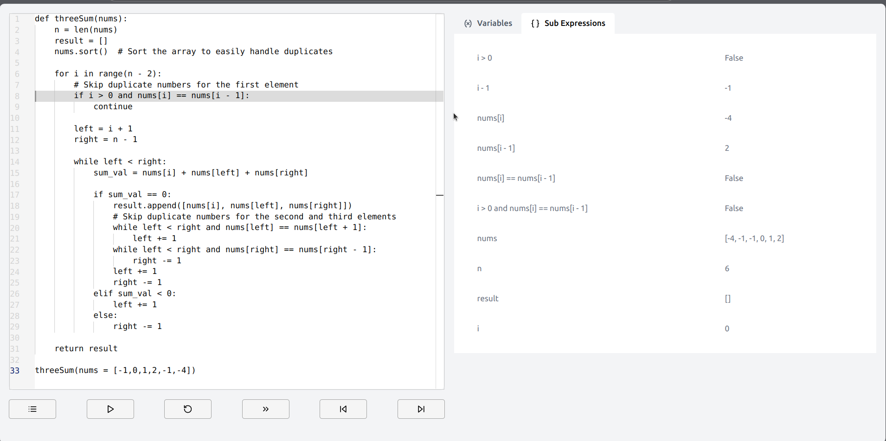

This project allows users to visually step through Python code solutions for LeetCode problems. It provides an interactive interface that highlights the current line of execution, along with real-time insights into the values of variables and sub-expressions at each step of the program.

Key Features:

- Step-through Execution: The program visually highlights the current line being executed, allowing users to follow the flow of the code.
- Variable Tracking: Users can view the values of key variables at each step, making it easier to understand how the program progresses and how data is manipulated.
- Sub-expressions Evaluation: Displays the intermediate results of sub-expressions and their evaluation, aiding in the understanding of complex logic.

### Usage
- Clone the repository
- Run the following command in the root directory of the repository
  ```
  $ pip3 install -r requirements.txt
  ```
  ```
  $ python3 main.py
  ```
- Open **main.html** in the browser.
- Follow the given template to write your code
    ```python
    # add your imports here

    def some_function():
        # add your code here
        return 
    
    some_function()

    ```


### TODO
- Add support for other Python Classes
